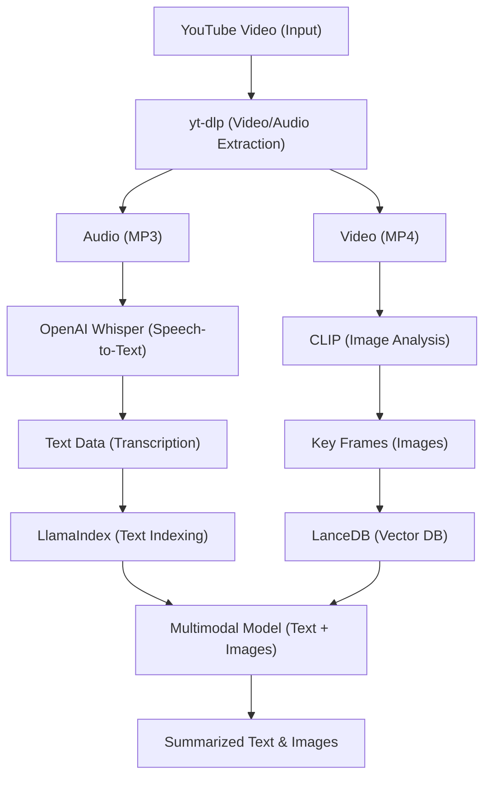

# Youtube Video Summarization

<div align="center">
  <!-- Backend -->
  
  
  
  
  
  
  
  
  
  
  
  <!-- Frontend -->
  
  
  

  <h3>Your AI Co-pilot for Youtube Video Summarization 🚀</h3>

  <p align="center">
    <b> LanceDB Retriever | OpenAI-Whisper | Clip | Gemini MultiModal  </b>
  </p>
</div>

# Overview
The <b> Youtube Video Summarization </b> focuses on creating a multimodal summary of YouTube videos by extracting and combining both audio and visual content. It begins by extracting the video and audio, then transcribes the spoken content into text. Key images or frames from the video are also extracted to capture visual elements. The transcribed text and images are indexed and stored for quick retrieval. Finally, a multimodal model processes both the text and images to generate a comprehensive summary, providing a richer and more detailed overview of the video.

# Motivation
The motivation behind this YouTube summarization project stems from the increasing volume of video content available online and the growing demand for efficient ways to consume and understand this content. YouTube, as one of the largest video platforms, hosts vast amounts of information, but manually watching and absorbing every video is time-consuming.

## key Features
  1. Extracting Video from YouTube with yt-dlp:
       - Role: This tool is used to download YouTube videos. It can download both the video and audio tracks in various formats. This is the starting point of the project, where the system retrieves the raw video content from YouTube.

  2. Extracting Audio and Transcribing Speech to Text using OpenAI Whisper:
       - Role: Whisper is a speech-to-text model developed by OpenAI, capable of transcribing spoken language from audio to text. This step converts the audio from the 
               YouTube video into text form, making the speech content accessible for further processing.
  3. Extracting Key Frames or Images from Video with CLIP:
       - Role: CLIP is a model that links images and text. It can understand the content of images in the context of natural language descriptions. This capability makes it 
               useful for extracting relevant visual information from a video.
  4. Storing and Indexing Data for Retrieval with LlamaIndex and LanceDB:
        - Role: These tools help manage and organize the extracted data (text and images), enabling quick retrieval and efficient searching for the multimodal summary generation.
  5. Multimodal Summary Generation:
        - Role: The final objective of your project is to generate a summary of the YouTube video by combining both text and images in a meaningful way.

## Architecture


## Project Structure

```
amazone-sales-chat-bot/
├── backend/
|  ├── src/
|  |   ├── __init__.py
|  │   ├── generate/                           
|  │   │   ├── __init__.py                     
|  │   │   ├── generate.py             
|  |   |── grade_documents
|  │   │   ├── __init__.py             
|  │   │   ├── grade_documents.py  
|  |   |── retrieve   
|  │   │   ├── __init__.py         
|  │   │   ├── retrieve.py         
|  |   ├── search_tool             
|  │   │   ├── __init__.py         
|  |   |   ├── web_search_tool.py  
|  |   |── transform_query
|  |   |   |── __init__.py
|  |   |   |── transform_query.py
|  │   ├── build_graph.py          
|  |   ├── esges.py
|  |   ├── state_template.py       
|  |   ├── structured_output.py 
|  │────── .env # If you want
|  │────── pyproject.toml # create virtual env using poetry
|  │────── main.py # Main entry point
|  ├── pyproject.toml
|  ├── ...
```

## Setup Instructions

### Backend Setup

1. Clone the repository
   ```bash
   git clone https://github.com/naveenkrishnan840/Youtube-Video-Summarization.git
   cd Youtube-Video-Summarization
   cd backend
   ```

2. Install Poetry (if not already installed)

   Mac/Linux:
   ```bash
   curl -sSL https://install.python-poetry.org | python3 -
   ```
   Windows:
   ```bash
   (Invoke-WebRequest -Uri https://install.python-poetry.org -UseBasicParsing).Content | python -
   ```

3. Set Python version for Poetry
   ```bash
   poetry env use python3.12
   ```

4. Activate the Poetry shell:
   For Unix/Linux/MacOS:
   ```bash
   poetry shell
   # or manually
   source $(poetry env info --path)/bin/activate
   ```
   For Windows:
   ```bash
   poetry shell
   # or manually
   & (poetry env info --path)\Scripts\activate
   ```

5. Install dependencies using Poetry:
   ```bash
   poetry install
   ```

6. Set up environment variables in `.env`:
   ```bash
    GOOGLE_API_KEY="Your api key"
    TAVILY_API_KEY="Your api key"
    OPEN_API_KEY= "Your api key"
    OPENROUTER_BASE_URL="your url"
    QDRANT_API_KEY="Your api key"
    QDRANT_URL="your url"
    LANGCHAIN_TRACING_V2=true
    LANGCHAIN_ENDPOINT="https://api.smith.langchain.com"
    LANGCHAIN_API_KEY="your api key"
    LANGCHAIN_PROJECT="your project name"
   ```

7. Run the backend:

   Make sure you are in the backend folder

    ```bash
    uvicorn app.main:app --reload --port 8000 
    ```

   For Windows User:

    ```bash
    uvicorn app.main:app --port 8000
    ```

8. Access the API at `http://localhost:8000`

### Frontend Setup

1. Open a new terminal and make sure you are in the WebRover folder:
   ```bash
   cd frontend
   ```

2. Install dependencies:
   ```bash
   npm install
   ```

3. Run the frontend:
   ```bash
   npm run dev
   ```

4. Access the frontend at `http://localhost:3000`

For mac users: 

Try running http://localhost:3000 on Safari browser. 

## License

This project is licensed under the MIT License - see the [LICENSE](LICENSE) file for details.

---

Made with ❤️ by [@naveenkrishnan840](https://github.com/naveenkrishnan840)
