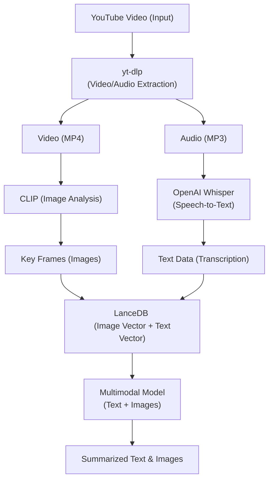

# Youtube Video Summarization

<div align="center">
  <!-- Backend -->
  
  
  
  
  
  
  
  
  
  
  
  <!-- Frontend -->
  
  
  

  <h3>Your AI Co-pilot for Youtube Video Summarization 🚀</h3>

  <p align="center">
    <b> LanceDB Retriever | OpenAI-Whisper | Clip | Gemini MultiModal  </b>
  </p>
</div>

# Overview
The <b> Youtube Video Summarization </b> focuses on creating a multimodal summary of YouTube videos by extracting and combining both audio and visual content. It begins by extracting the video and audio, then transcribes the spoken content into text. Key images or frames from the video are also extracted to capture visual elements. The transcribed text and images are indexed and stored for quick retrieval. Finally, a multimodal model processes both the text and images to generate a comprehensive summary, providing a richer and more detailed overview of the video.

# Motivation
The motivation behind this YouTube summarization project stems from the increasing volume of video content available online and the growing demand for efficient ways to consume and understand this content. YouTube, as one of the largest video platforms, hosts vast amounts of information, but manually watching and absorbing every video is time-consuming.

## key Features & Explanation
  1. Extracting Video from YouTube with yt-dlp:
       - Package: ** yt-dlp **
       - Role: This tool is used to download YouTube videos. It can download both the video and audio tracks in various formats. This is the starting point of the project, where the system retrieves the raw video content from YouTube.
       - Output: You get the video in formats such as MP4 or audio in formats like MP3.

  2. Extracting Audio and Transcribing Speech to Text using OpenAI Whisper:
       - Package: ** OpenAI Whisper **
       - Role: Whisper is a speech-to-text model developed by OpenAI, capable of transcribing spoken language from audio to text. This step converts the audio from the 
               YouTube video into text form, making the speech content accessible for further processing.  
       -  Use: After downloading a YouTube video using yt-dlp, Whisper is used to convert any spoken content in the video into text. This transcription is essential for creating the summary, as it allows the system to analyze the video's spoken content rather than relying on visuals alone.
         
  3. Extracting Key Frames or Images from Video with CLIP:
       - Package: ** CLIP (Contrastive Language-Image Pre-training) **
       - Role: CLIP is a model that links images and text. It can understand the content of images in the context of natural language descriptions. This capability makes it 
               useful for extracting relevant visual information from a video.
	- Process:
        	- From the downloaded video, you can extract key frames or still images that represent important visual scenes.Alternatively, CLIP can help you identify and 			analyze specific scenes or images within the video based on textual queries.
	- Output: Key images or frames from the video, which could contain vital information related to the summary.

  5. Storing and Indexing Data for Retrieval with LlamaIndex and LanceDB:
        - Packages: ** LlamaIndex (for indexing), LanceDB (for vector database) **
        - Role: These tools help manage and organize the extracted data (text and images), enabling quick retrieval and efficient searching for the multimodal summary generation.
        - LlamaIndex:
		- This tool helps to index the extracted text and images into a structured format, like a knowledge graph or indexed database. It makes the data easily searchable and accessible.
		- Text data (from Whisper) is indexed by LlamaIndex for quick access.
		- Image data (from CLIP) could be paired with descriptive text and indexed for efficient retrieval during summary generation.
	- LanceDB:
		- LanceDB is a vector database that helps store and search high-dimensional embeddings (numerical representations) of the data.
		- After extracting both text and images, they are turned into embeddings (using models like CLIP for images and Whisper for text). These embeddings are 			stored in LanceDB, which allows fast retrieval based on similarity.
	- Output: A structured, indexed database of video content, both in the form of transcriptions (text) and visual information (images).

  7. Multimodal Summary Generation:
        - Role: The final objective of your project is to generate a summary of the YouTube video by combining both text and images in a meaningful way.
        - Process:
		- The text (transcribed by Whisper) provides the spoken content from the video.
		- The images (extracted using CLIP) represent key visual elements.
		- The multimodal model combines these two data sources (text and images) to produce a more accurate and comprehensive summary, potentially using a language 			model like Gemini model.
	- How the Model Works:
		- The model processes the transcribed text and visual data (stored as embeddings in LanceDB) to identify key points from both modalities.
		- It can use the text to identify speech and the images to identify key visual elements, producing a summary that incorporates both.
	- Output: A concise summary that includes both textual and visual cues from the video.

## Architecture




## Project Structure
```
Youtube-Video-Summarization/
├── backend/
|  ├── src/
|  |   ├── audio_path/
|  │   ├── documents/                           
|  │   │   ├── image.png                     
|  │   │   ├── audio_text.txt             
|  |   |── lancedb/
|  │   │   ├── image_collections.lance/
|  │   │   ├── text_collections.lance/
|  |   |── tokenizer_path/         
|  |   ├── video_path/
|  |   |── whisper_model_path/
|  │   ├── request_validate.py          
|  |   ├── video_extract.py
|  │────── .env # If you want
|  │────── pyproject.toml # create virtual env using poetry
|  │────── main.py # Main entry point
|  ├── pyproject.toml
|  ├── ...
```

## Setup Instructions

### Backend Setup

1. Clone the repository
   ```bash
   git clone https://github.com/naveenkrishnan840/Youtube-Video-Summarization.git
   cd Youtube-Video-Summarization
   cd backend
   ```

2. Install Poetry (if not already installed)

   Mac/Linux:
   ```bash
   curl -sSL https://install.python-poetry.org | python3 -
   ```
   Windows:
   ```bash
   (Invoke-WebRequest -Uri https://install.python-poetry.org -UseBasicParsing).Content | python -
   ```

3. Set Python version for Poetry
   ```bash
   poetry env use python3.12
   ```

4. Activate the Poetry shell:
   For Unix/Linux/MacOS:
   ```bash
   poetry shell
   # or manually
   source $(poetry env info --path)/bin/activate
   ```
   For Windows:
   ```bash
   poetry shell
   # or manually
   & (poetry env info --path)\Scripts\activate
   ```

5. Install dependencies using Poetry:
   ```bash
   poetry install
   ```

6. Set up environment variables in `.env`:
   ```bash
    DOCUMENTS_PATH="your docs path"
    AUDIO_PATH="your audio path"
    IMAGE_FORMAT=frame%04d.png
    AUDIO_FORMAT=output_audio.mp3
    VIDEO_PATH="your video path"
    AUDIO_TEXT_FORMAT=audio_text.txt
    OUTPUT_AUDIO_PATH=output_text.txt
    GOOGLE_API_KEY="you api here"
    LANCEDB_PATH="your DB path"
   ```

7. Run the backend:

   Make sure you are in the backend folder

    ```bash
    uvicorn app.main:app --reload --port 8000 
    ```

   For Windows User:

    ```bash
    uvicorn app.main:app --port 8000
    ```

8. Access the API at `http://localhost:8000`

### Frontend Setup

1. Open a new terminal and make sure you are in the WebRover folder:
   ```bash
   cd frontend
   ```

2. Install dependencies:
   ```bash
   npm install
   ```

3. Run the frontend:
   ```bash
   npm run dev
   ```

4. Access the frontend at `http://localhost:3000`

For mac users: 

Try running http://localhost:3000 on Safari browser. 

## License

This project is licensed under the MIT License - see the [LICENSE](LICENSE) file for details.

---

Made with ❤️ by [@naveenkrishnan840](https://github.com/naveenkrishnan840)
